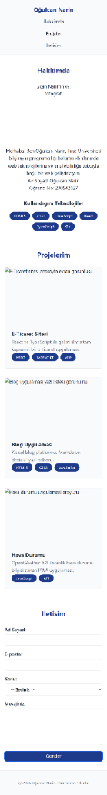

# 🚀 Oğulcan Narin - Kişisel Portfolyo



Bu proje, **Web Tasarımı ve Programlama** dersi kapsamında gerçekleştirilen **LAB-1, LAB-2 ve LAB-3** laboratuvar föylerinin tüm isterlerini bir araya getiren modern, duyarlı (responsive) ve erişilebilir (a11y) bir kişisel web portfolyosudur.

---

## 👨‍💻 Geliştirici Bilgileri
- **Ad Soyad:** Oğulcan Narin
- **Öğrenci No:** 230542027
- **Okul:** Fırat Üniversitesi Bilgisayar Programcılığı

## 🛠️ Kullanılan Teknolojiler
Bu projede sektör standartlarında modern web teknolojileri kullanılmıştır:
- **React 18 & TypeScript:** Güçlü, veri tipli ve bileşen (component) tabanlı modern UI kütüphanesi.
- **Vite:** Çok hızlı, yeni nesil derleyici ve geliştirme sunucusu aracı.
- **Semantik HTML5:** SEO ve ekran okuyucu dostu, yapısal ve anlamlı (`<main>`, `<header>`, `<article>`) etiket kullanımı.
- **CSS3 & Design Tokens:** `clamp()` ile akıcı tipografi (Fluid Typography), tek kaynaktan yönetilen root renk değişkenleri ve Flexbox/Grid yapısı.
- **A11y (Erişilebilirlik):** Tab le gezinme, körler için odak özellikleri ve "Ana içeriğe atla (Skip Link)" butonu entegrasyonu.

---

## 📱 Laboratuvar Kazanımları

### LAB-1: Temel Ortam ve Git
- Node.js, npm ve Vite kullanılarak projenin iskeleti atıldı.
- Sürüm kontrol sistemi (Git) entegre edildi, projede anlamlı `commit` ve `branch` mimarisi sağlandı.
- Gereksiz dosyalar `.gitignore` a dahil edildi.

### LAB-2: Erişilebilirlik (A11y) ve HTML5 Formları
- Site baştan sona Semantik HTML kurallarına ve mantıksal hiyerarşilere (`h1 -> h2 -> h3`) uygun çizildi.
- İmaj alt etiketleri ve görme engelli veya sadece klavye kullanan bireyler için ARIA kuralları uygulandı.
- Front-end testleri için gerekli olan Label ve hata bildirim mekanizmalarını barındıran erişilebilir form inşa edildi.

### LAB-3: Modern CSS & Responsive Mimari
- Proje ilk olarak **Mobile-First (Mobil Öncelikli)** mimaride kodlandı.
- CSS Değişkenleri (Tokens) sistematiğine geçilerek renk paleti, padding ve font skalaları merkezileştirildi. 
- Menü yapısı **Flexbox**, Projeler ızgarası ise cihaz çözünürlüğüne adapte olabilen **CSS Grid** `repeat(auto-fit)` formatı ile tasarlandı.

---

## ⚙️ Kurulum ve Çalıştırma

Projeyi lokal bilgisayarınızda çalıştırmak için aşağıdaki adımları sırayla uçbirime (terminal) giriniz:

1. Bağımlılıkları Yükleyin:
```bash
npm install
```

2. Geliştirici Sunucusunu Başlatın:
```bash
npm run dev
```

Ardından tarayıcınızda terminalde belirtilen yerel adrese (Genellikle `http://localhost:5173`) giderek projeyi canlı test edebilirsiniz.
